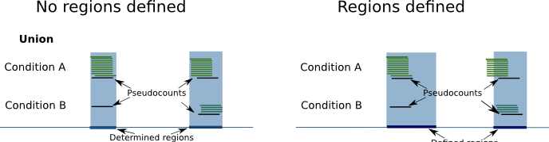

Pyicoenrich
===========

Enrichment analysis can be applied on any type of -seq data. Pyicoenrich performs enrichment analysis on sequenced reads from two conditions. Like this you can find out how significant the difference of these two conditions is, in terms of the number/density of reads overlapping a region of interest. 

For example, you might expect significant differences between different conditions, while you would not expect significant differences between biological replicas. Based on this assumption Pyicoenrich calculates Z-Scores for each region of interest. If no replicas are provided Pyicoenrich creates technical replicas (see below).

.. figure:: images/enrichment.png

Region generation
-----------------

In order to decide what regions are to be explored, you have 3 main options:

Provide a regions file
""""""""""""""""""""""""

If a region file is provided, Pyicoenrich returns for each region a z-Score (among others) which indicates the enrichment/depletion of condition A over condition B. The region file should be in BED format. Also, you may consider only discontinuous regions by using the BED12 format::

        pyienrich -reads kidney1.bed liver1.bed -output Pyicoenrich_Kidney_Liver_result_Counts -f bed *--region genes.bed* 

Generate a file with the --region-magic flag and GTF file
""""""""""""""""""""""""""""""""""""""""""""""""""""""""""""
See Pyicoregion_. for examples on how to use region magic.

Do nothing
"""""""""""""

Feeling lazy and don't really want to care about regions files? No worries. If no region file is provided, Pyicoenrich provides the options to take the union of reads from both conditions as a region and gives back Z-Scores for the generated regions. 

--pseudocounts
----------------

As regions with 0 reads in one condition might be especially interesting, Pyicoenrich can use pseudocounts, in order to avoid a division by 0: Pyicoenrich calculates the ratio of number of reads in both conditions. As there might not be any reads in a region, Pyicoenrich assumes that there is already 1 read in each region in each condition.

To calculate the Z-Score, Pyicoenrich compares the differences between condition A and condition B with the differences between A and A' (while A' is the biological replica of A). If no biological replica is available, Pyicoenrich uses a sample swap as a reference. With sample swap we mean that reads from condition A and B are mixed randomly and divided in two sets (with size of those of A and B). In the two resulting sets we do not expect any significant differences, just like in replicas.  

.. figure:: images/swap.png

Description of the counts file
-----------------------------------

Column description of enrichment result where each line describes a region: 
name	start	end	name2	score	strand	signal_a	signal_b	signal_prime_1	signal_prime_2	A	M	total_reads_a	total_reads_b	num_tags_a	num_tags_b	A_prime	M_prime	total_reads_a	total_reads_b	total_reads_background_1	total_reads_background_2	A_median	mean	sd	zscore

1) name                    =  chromosome of region
2) start                   =  region start
3) end                     =  region end
4) name2                   =  alternative label for the region, useful to put the gene name on it
5) score                   =  Reserved by a "." as it is used by the UCSC browser for coloring. 
6) strand                  =  region strand
7) signal_a                =  Counts in experiment A (normalized if used)
8) signal_b                =  Counts in experiment B (normalized if used)
9) signal_prime_1          =  Counts in experiment A (exactly the same as signal_a) or random background 1 (normalized if used) 
10) signal_prime_2         =  Counts in experiment replica A or random background 2 (normalized if used) 
11) A                      =  (log2(signal_a)+log2(signal_b))/2
12) M                      =  log2(signal_a/signal_b)
13) total_reads_a          =  total number of reads in sample a
14) total_reads_b          =  total number of reads in sample b
15) num_tags_a             =  number of reads in sample a overlapping the region
16) num_tags_b             =  number of reads in sample b overlapping the region
17) A_prime                =  (log2(signal_prime_1)+log2(signal_prime_2))/2    
18) M_prime                =  log2(signal_prime_1/signal_prime_2)   
19) total_reads_a          =  total number of reads in sample a
20) total_reads_b          =  total number of reads in sample b
21) total_reads_prime_1    =  total number of reads in sample prime 1 
22) total_reads_prime_2    =  total number of reads in sample prime 2
23) A_median	           =   median of A values in window
24) mean	               =   mean of M_prime values in window
25) sd	                   =   standard deviation of M_prime values in window
26) zscore                 =  score for the significance of the difference of enrichment between condition a and b compared to prime 1  and prime 2 
          

Normalization methods
------------------------

Examples::

    # Calculations based on count data:    
    pyienrich -reads kidney1.bed liver1.bed -output Pyicoenrich_Kidney_Liver_result_Counts -f bed --region genes.bed --open-region --stranded --replica kidney2.bed --pseudocount --skip-header
   
    # Calculations based on count data normalized by number of reads in sample:    
    pyicos enrichment kidney1.bed liver1.bed Pyicoenrich_Kidney_Liver_result_Counts -f bed --region genes.bed --open-region --stranded --replica kidney2.bed --pseudocount --skip-header --n-norm 

    # To use RPKM normalization    
    pyicos enrichment kidney1.bed liver1.bed Pyicoenrich_Kidney_Liver_result_RPKM -f bed --region genes.bed --open-region --stranded --replica kidney2.bed --pseudocount --skip-header --n-norm --len-norm

    # To use TRPK normalization 
    pyicos enrichment kidney1.bed liver1.bed Pyicoenrich_Kidney_Liver_result_RPKM -f bed --region genes.bed --open-region --stranded --replica kidney2.bed --pseudocount --skip-header --n-norm --len-norm --tmm-norm

    # To use Full quantile normalization 
    pyicos enrichment kidney1.bed liver1.bed Pyicoenrich_Kidney_Liver_result_RPKM -f bed --region genes.bed --open-region --stranded --replica kidney2.bed --pseudocount --skip-header --quant-norm

Credit
------

* Developer: Juan González-Vallinas
* Beta Testing: Sonja Althammer, Eneritz Agirre, Nuria Conde Pueyo, Juan González-Vallinas
* Benchmarking against other methods: Sonja Althammer
* Performance benchmarking: Juan González-Vallinas
